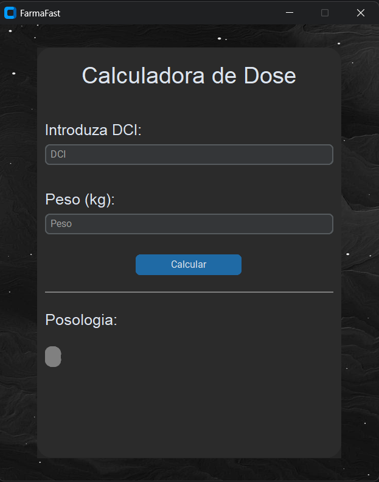

#  FarmaFast

##  About the Project

**FarmaFast** is a Python-based application with a graphical interface designed to assist in calculating medication dosages, particularly antibiotics.

This project was inspired by a conversation with a pharmacist, who highlighted that dosage calculations are still often done manually without the support of dedicated software. Based on this real-world need, this solution was designed to make the process simpler, faster, and more reliable.

---

##  Interface Preview

  

---

##  Purpose

To simplify and automate dosage calculations based on:

* Patient weight
* Recommended daily dosage
* Number of doses per day
* Conversion between mg and ml

Helping to reduce:

* Human error
* Calculation time
* Manual workload

---

## Features

* Intuitive graphical user interface (CustomTkinter)
* Input for DCI (International Nonproprietary Name)
* Automatic dosage calculation
* Input validation (weight and DCI)
* Dose conversion (mg → ml)
* Final dosage per administration

---

##  Database

The database was created based on data from **Infarmed**.

⚠️ **Note:**
The database is still under construction and will be expanded with additional molecules and parameters over time.

---

##  Technologies Used

* Python
* CustomTkinter
* JSON
* Pillow (PIL)

##  Project Status

🔧 In development

* UI improvements
* Database expansion
* Potential future API integration

---

##  Contributing

Contributions, suggestions, and improvements are welcome!

---

##  License

This project is intended for educational purposes and is currently under development.

---

##  Author

Developed by **Tania Dias**
